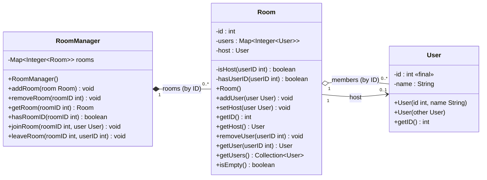

# `com.example.roommanager` — Structure Overview

This package implements a small **chat-room / lobby management model** built from three cooperating classes:

- **`RoomManager`** — the top-level registry of rooms (facade over a room map).
- **`Room`** — a single room that owns its members and designates a host.
- **`User`** — an immutable-ID participant record.

## Mermaid Class Diagram

## Class Details

### 1. `RoomManager` (`src/com/example/roommanager/RoomManager.java`)

**Role:** Central coordinator. Owns all `Room` objects and routes membership actions (`join`/`leave`) to the right room.

| Kind | Member | Description |
|---|---|---|
| field | `- Map<Integer, Room> rooms` | Registry keyed by room ID (`final`, initialized to empty `HashMap`). |
| method | `+ addRoom(Room)` | Registers a room; throws `IllegalArgumentException` on duplicate room ID. |
| method | `+ removeRoom(int)` | Deletes a room; throws if the ID is unknown. |
| method | `+ getRoom(int)` | Returns the room or throws `IllegalArgumentException` if absent. |
| method | `+ hasRoomID(int) : boolean` | Pure lookup predicate. |
| method | `+ joinRoom(int, User)` | Delegates to `Room.addUser` after fetching the room. *(TODO comment: wrap in try/catch.)* |
| method | `+ leaveRoom(int, int)` | Delegates to `Room.removeUser`. *(TODO comment: wrap in try/catch.)* |

### 2. `Room` (`src/com/example/roommanager/Room.java`)

**Role:** A container of participants with automatic **host succession** when the host leaves.

| Kind | Member | Description |
|---|---|---|
| field | `- final int id` | Immutable room identifier (always `0`; only set by the default constructor). |
| field | `- Map<Integer, User> users` | Members keyed by user ID. |
| field | `- User host` | Currently designated host, may be `null`. |
| method | `- isHost(int) : boolean` | Private helper: true if given ID matches the host's ID. |
| method | `- hasUserID(int) : boolean` | Private helper: membership check. |
| ctor | `+ Room()` | Empty room, no host. |
| method | `+ addUser(User)` | Inserts by ID; throws on duplicate user ID. |
| method | `+ setHost(User)` | Promotes an existing member to host; throws if the user isn't a member (looks up the stored instance rather than trusting the argument). |
| method | `+ getID() : int` | Room ID accessor. |
| method | `+ getHost() : User` | May return `null` when no host. |
| method | `+ removeUser(int)` | Removes a member. If they were the host: clears host when the room becomes empty, otherwise promotes an arbitrary remaining member. Throws if the ID is unknown (message mistakenly references the room's own `id`). |
| method | `+ getUser(int) : User` | Returns one member or throws (message text says "already", meaning "no"). |
| method | `+ getUsers() : Collection<User>` | Unmodifiable view of members (`Collections.unmodifiableCollection`). |
| method | `+ isEmpty() : boolean` | True when there are no members. |

### 3. `User` (`src/com/example/roommanager/User.java`)

**Role:** Plain data holder (POJO). Identity (`id`) is immutable; display name is mutable in principle but currently has **no getter/setter** exposed.

| Kind | Member | Description |
|---|---|---|
| field | `- final int id` | Unique identity, fixed at construction. |
| field | `- String name` | Display name (currently inaccessible from outside). |
| ctor | `+ User(int, String)` | Primary constructor. |
| ctor | `+ User(User other)` | Copy constructor (shallow copy; fine since fields are immutable types). |
| method | `+ getID() : int` | Only accessor present. |

## Relationships Summary

1. **Composition — `RoomManager` → `Room`**: the manager owns the lifecycle of rooms in its map.
2. **Aggregation — `Room` → `User`**: a room references its members; the same `User` object could conceptually exist outside a room.
3. **Association — `Room` → `User` (host)**: a single optional reference marking leadership among the members.

## Notable Observations / Potential Issues

- `Room.id` can only ever be `0` (no constructor takes an ID), and `RoomManager.addRoom` never assigns one — duplicate-ID protection is effectively inert until IDs are generated elsewhere.
- Error messages in `Room.removeUser` and `Room.getUser` are swapped/wrong ("already"/room `id` instead of the offending `userID`).
- Host succession picks "a random member" (first entry of `HashMap.values()`), i.e., nondeterministic order.
- `joinRoom`/`leaveRoom` propagate raw `IllegalArgumentException`s; TODOs suggest wrapping them.
- `User.name` is unreachable externally (no getter), making the field dead weight as written.
