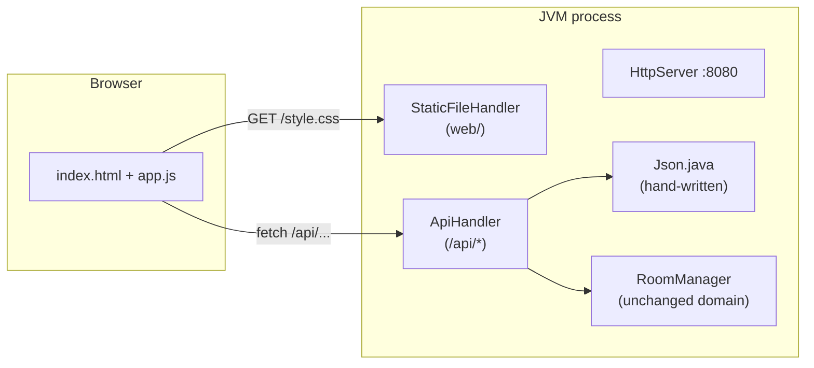

# Study Plan: Room Manager → Web Backend

A self-paced roadmap that turns `com.example.roommanager` into a working web application using **only the JDK** — no Maven, no Spring, no external libraries. You write the code; this document is your guide.

---

## Why this plan exists

You already understand Java fundamentals (classes, maps, encapsulation, manual compilation). The next layer of knowledge is:

1. How HTTP actually works (requests, responses, status codes, headers)
2. How a server is structured (routing, handlers, request/response cycle)
3. How JSON fits in (and what libraries like Jackson do for you)
4. Concurrency basics (a server handles many requests at once)

By building it by hand first, frameworks like Spring Boot will later feel like convenience — not magic.

## Ground rules

- **You write every line yourself.** Use this doc for direction, not copy-paste.
- **One phase = one commit** (or more). Small commits make debugging easier.
- When stuck: read the JDK Javadoc for the class in question first, then ask for a hint.
- The domain classes (`Room`, `User`, `RoomManager`) stay untouched until Phase 6 — refactoring them is *your* exercise.

## Target architecture



Target file layout:

```text
basic-watch/
├── src/com/example/roommanager/
│   ├── Room.java              ← untouched until Phase 6
│   ├── User.java              ← untouched until Phase 6
│   ├── RoomManager.java       ← untouched until Phase 6
│   └── web/
│       ├── Main.java          ← Phase 1: starts the server
│       ├── StaticFileHandler.java ← Phase 2
│       ├── ApiHandler.java    ← Phases 3–4
│       └── Json.java          ← Phase 3
├── web/                       ← static frontend files
│   ├── index.html             ← Phase 2
│   ├── style.css              ← Phase 5
│   └── app.js                 ← Phase 5
└── out/                       ← compiled classes (existing workflow)
```

Key design rule: **the web layer depends on the domain, never the reverse.** `Room` must not know HTTP exists.

---

## Phase 0 — HTTP fundamentals

**Goal:** Be able to read a raw HTTP conversation before writing any server code.

**Estimated time:** ~30–45 minutes (reading only)

### Learn

| Concept | What to understand |
|---|---|
| Request line | `METHOD /path HTTP/1.1` — method, path, version |
| Methods | `GET` (read), `POST` (create), `DELETE` (remove), `PUT/PATCH` (update) |
| Headers | Metadata: `Host`, `Content-Type`, `Content-Length`, `Accept` |
| Body | Payload of POST/PUT requests; usually absent in GET/DELETE |
| Status codes | `200 OK`, `201 Created`, `204 No Content`, `400 Bad Request`, `404 Not Found`, `409 Conflict`, `500 Server Error` |
| Content-Type | Tells the receiver how to interpret the body (`text/html`, `application/json`) |

### Do

1. Run `curl -v https://example.com` and identify: request line, headers, response status, body.
2. Open your browser's DevTools → Network tab, visit any website, click one request and find its method, status, and content-type.
3. Write down (on paper!) what you think `POST /api/rooms` should return on success and on failure.

### Check yourself

- [ ] I can explain the difference between a header and a body.
- [ ] I know which status code means "created" vs "not found" vs "conflict".
- [ ] I can explain why GET requests don't have a meaningful body.

---

## Phase 1 — First server

**Goal:** A running HTTP server on port 8080 answering one endpoint with plain text.

**Estimated time:** 1–2 hours

### Learn

| JDK class/method | Role |
|---|---|
| `com.sun.net.httpserver.HttpServer` | The embedded server |
| `HttpServer.create(InetSocketAddress, backlog)` | Bind to a port |
| `server.createContext(path, handler)` | Register a handler for a path prefix |
| `server.setExecutor(...)` | Thread pool that runs handlers |
| `server.start()` | Non-blocking start |
| `com.sun.net.httpserver.HttpExchange` | One request+response; gives you streams, headers, status control |

### Build

Create `src/com/example/roommanager/web/Main.java`:

1. Create the server bound to `localhost:8080`.
2. Register context `/api/ping` with an inline (or small named) handler that responds `"pong"` as `text/plain`.
3. Set an executor: `Executors.newFixedThreadPool(4)` — think about *why* a server needs more than one thread.
4. Start the server. Note: `start()` returns immediately — keep the JVM alive (e.g., `Thread.currentThread().join()` or just keep it simple for now).

Compile & run with your existing workflow:

```bash
javac -d out $(find src -name "*.java")
java -cp out com.example.roommanager.web.Main
```

Verify from another terminal:

```bash
curl -v http://localhost:8080/api/ping
```

### Hints (not solutions)

- You must send response headers *before* the body: look at `exchange.getResponseHeaders()`, `sendResponseHeaders(status, length)` and `getResponseBody()`.
- Response body length `-1` means "chunked"; otherwise pass the byte count.
- Always close the output stream (try-with-resources).

### Check yourself

- [ ] `curl -v` shows status 200 and `pong`.
- [ ] I can explain what happens when two requests arrive at once.
- [ ] I know what happens if I forget `sendResponseHeaders`.

---

## Phase 2 — Serving static files

**Goal:** Visiting `http://localhost:8080/` shows a real HTML page.

**Estimated time:** 2–3 hours

### Learn

- MIME types: `.html → text/html`, `.css → text/css`, `.js → text/javascript`, `.png → image/png`
- Path handling: `exchange.getRequestURI().getPath()` — note `/` should map to `/index.html`
- Reading files: `Files.readAllBytes(Path)` or `InputStream.transferTo(...)`
- Security: never serve files outside your web root (reject paths containing `..`)

### Build

1. Create `web/index.html` — minimal page with an `<h1>Room Manager</h1>` and a link to `style.css`.
2. Create `web/style.css` — anything visible (e.g., colored background), so you can confirm CSS loads.
3. Create `web/StaticFileHandler.java`:
   - Resolve the requested path against your `web/` directory.
   - Default `/` → `/index.html`.
   - Pick the correct `Content-Type` per extension (a small `switch` or map).
   - Send 404 (with a tiny text body) when the file doesn't exist.
4. Register it in `Main.java` on context `/`.

### Hints

- Contexts match by prefix: `/` also matches `/api/ping` unless the more specific context wins — test which one actually serves. (Order/specificity matters; experiment!)
- If the browser downloads instead of renders, your `Content-Type` is wrong.

### Check yourself

- [ ] Browser shows the styled page at `http://localhost:8080/`.
- [ ] Missing file returns 404, not a stack trace.
- [ ] A path like `/../../etc/passwd` does NOT leak a file (test it!).

---

## Phase 3 — Read-only API + hand-written JSON

**Goal:** `GET /api/rooms` and `GET /api/rooms/{id}` return your real data as JSON.

**Estimated time:** 3–4 hours

### Learn

- JSON syntax: objects `{}`, arrays `[]`, strings need escaping (`\"`, `\\`, `\n`)
- Why hand-write it? Because then Jackson/Jackson-style libraries are never mysterious.
- URL structure: parsing `/api/rooms/3` via `getPath().split("/")` (watch out for empty strings and trailing slashes).

### Build

1. `web/Json.java` — static helper methods:
   - `quote(String s)` — wraps in quotes and escapes `\` and `"` (minimum viable escaping).
   - `userToJson(User u)` — `{"id":1,"name":"Alice"}`
   - `roomToJson(Room r)` — include room id, host (or `null`), and members array. You'll need `getUsers()` (already unmodifiable — nice).
   - `roomsToJson(Collection<Room>)` — comma-join objects inside `[...]`.
2. In `Main.java` (or a new `ApiHandler.java`), register context `/api`:
   - Route by method + path segments:
     - `GET /api/rooms` → list all rooms
     - `GET /api/rooms/{id}` → one room, or 404 with a JSON error body like `{"error":"no room with id 3"}`
   - Parse the room id with `Integer.parseInt` — handle `NumberFormatException` → 400.
3. Instantiate one shared `RoomManager` in `Main` and pass it to handlers. For testing, pre-add a couple of rooms/users in code so responses aren't empty.

### Hints

- Your model has no way to list all rooms yet! Look at `RoomManager.rooms` — it's private. Options: add a getter yourself (fine — it's web-layer-driven change) or expose `Collection<Room>`. This is your first taste of "the web layer shapes the API".
- `Map<Integer, Room>.values()` gives you the rooms; keys give IDs.

### Check yourself

- [ ] `curl http://localhost:8080/api/rooms` prints valid JSON (paste it into a JSON validator).
- [ ] Unknown room id → 404 + JSON error, no stack trace.
- [ ] Non-numeric id (`/api/rooms/abc`) → 400, no crash.

---

## Phase 4 — Mutations (create, join, leave)

**Goal:** Full lifecycle through the API.

**Estimated time:** 3–5 hours

### Endpoints to implement

| Method | Path | Action | Success | Errors |
|---|---|---|---|---|
| POST | `/api/rooms` | create empty room | 201 + created room JSON | — |
| DELETE | `/api/rooms/{id}` | remove room | 204 | 404 |
| POST | `/api/rooms/{id}/users?name=Alice` | create user & join | 201 + user JSON | 404 room missing, 409 duplicate user id |
| DELETE | `/api/rooms/{id}/users/{userId}` | leave room | 204 | 404 room or user missing |

### Learn

- Reading query parameters: `exchange.getRequestURI().getQuery()` → raw string `name=Alice&x=1`; split on `&` then `=`; use `URLDecoder.decode` for spaces.
- Reading a request body: `exchange.getRequestBody()` (an `InputStream`). For form data, read all bytes and parse `key=value` pairs the same way.
- Status discipline: 201 must come with the new resource; 204 must have NO body; errors get JSON bodies.
- Mapping exceptions: catch `IllegalArgumentException` from your domain and translate to 404/409 depending on context. (Crude but works — Phase 6 improves this.)

### Hints

- Your current `User` requires the caller to supply an ID and `Room.addUser` rejects duplicates. For now, generate a random ID per join (`new Random().nextInt(...)` retry loop, or timestamp-based). Note how awkward this feels — that discomfort is exactly what motivates the Phase 6 refactor.
- Test everything with curl before touching the frontend:

```bash
# create
curl -v -X POST http://localhost:8080/api/rooms
# join
curl -v -X POST "http://localhost:8080/api/rooms/0/users?name=Alice"
# leave
curl -v -X DELETE http://localhost:8080/api/rooms/0/users/17
# delete room
curl -v -X DELETE http://localhost:8080/api/rooms/0
```

### Check yourself

- [ ] Full lifecycle works via curl: create → join ×2 → inspect → leave → delete.
- [ ] Joining twice with the same generated ID yields 409, not a crash.
- [ ] Every error path returns JSON (or nothing for 204), never a stack trace.

---

## Phase 5 — Wire up the frontend

**Goal:** A single-page UI in the browser: see rooms, create one, join, leave.

**Estimated time:** 3–5 hours

### Learn

- `fetch()` promise chain: `fetch(url).then(r => r.json()).then(data => ...)`
- Sending non-GET requests: `fetch(url, {method:'POST'})`
- DOM manipulation: `document.querySelector`, `createElement`, `textContent` (avoid `innerHTML` with user input — XSS habit)
- Polling: `setInterval(refreshRooms, 2000)` — crude but effective; WebSockets come much later.

### Build (`web/app.js` + upgrades to `index.html`)

1. On load and every 2s: fetch `/api/rooms`, render each room as a card (id, host name, member names).
2. Button/form: create room → POST → refresh immediately.
3. Per-room form: name input + Join button → POST users → refresh.
4. Per-member Leave button → DELETE → refresh.
5. Show API errors in the UI (read the JSON `error` field) instead of failing silently.

### Check yourself

- [ ] Two browser windows show consistent state within ~2 seconds.
- [ ] Creating/joining/leaving from the UI works end-to-end.
- [ ] Invalid actions (leave a room you're not in) surface a readable error message.

---

## Phase 6 — Self-guided refactors (your homework, deliberately unsolved)

Do these one commit at a time, in roughly this order. Each solves a pain you should have already felt.

1. **`User.getName()`** — the frontend wants member names; right now `name` is unreachable. Add the getter, use it in `Json.java`.
2. **Real ID generation** — replace random/timestamp hacks with counters (`AtomicInteger.incrementAndGet()` in `RoomManager` for rooms, in `Room` for users). Remove ID parameters from constructors where sensible.
3. **Specific exceptions** — introduce e.g. `NotFoundException` and `ConflictException`; throw them from the domain; map them once in the web layer instead of guessing 404-vs-409 per call site.
4. **Fix misleading messages** — `Room.removeUser` reports the room's own `id`; `getUser` says "already" when it means "no". Fix both; add a comment style you like.
5. **Thread safety** ⚠️ — your executor runs handlers concurrently while `HashMap` is being mutated. Research `ConcurrentHashMap` vs `Collections.synchronizedMap` vs `synchronized` blocks; pick one and justify it in the commit message. Try to reproduce a race first if you can (hint: hammer join/leave from two terminals simultaneously).
6. **Stretch: persistence** — save/load rooms to a JSON file on shutdown/startup.
7. **Stretch: real JSON parsing** — accept `{"name":"Alice"}` bodies instead of query params (hand-roll a minimal parser or study one).

---

## Milestone checklist

- [ ] Phase 0–1: server answers `/api/ping`
- [ ] Phase 2: styled page served at `/`
- [ ] Phase 3: rooms visible as JSON
- [ ] Phase 4: full CRUD lifecycle via curl
- [ ] Phase 5: usable browser UI
- [ ] Phase 6: at least items 1–5 done

After that you'll have earned Maven + Spring Boot: same endpoints, a fraction of the code — and you'll know exactly what it's doing for you.

## Quick reference

**Run:** `javac -d out $(find src -name "*.java") && java -cp out com.example.roommanager.web.Main`

**Status codes:** 200 read ok · 201 created · 204 deleted · 400 bad input · 404 missing · 409 conflict · 500 bug

**Curl:** `curl -v URL` · `-X POST` · `-X DELETE` · `"?key=value"` (quote URLs with `&`)

**JDK classes:** `HttpServer`, `HttpExchange`, `InetSocketAddress`, `Executors`, `URLDecoder`, `Files`, `AtomicInteger`
